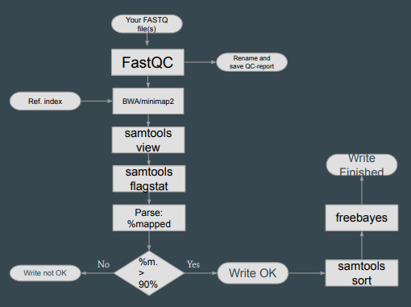
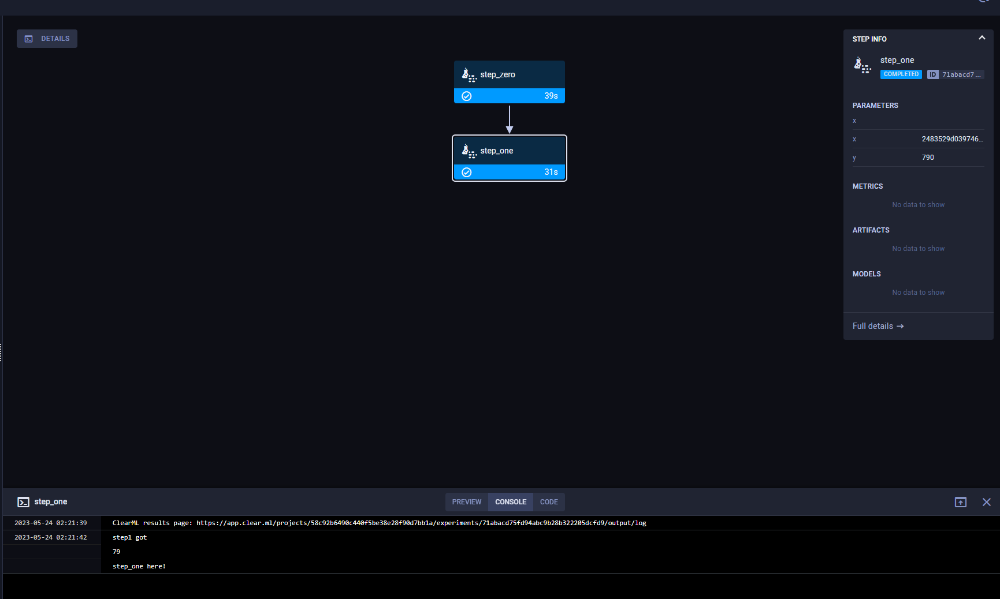
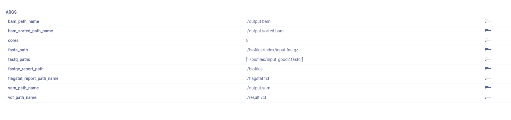
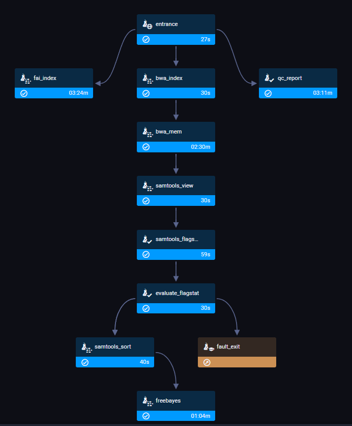
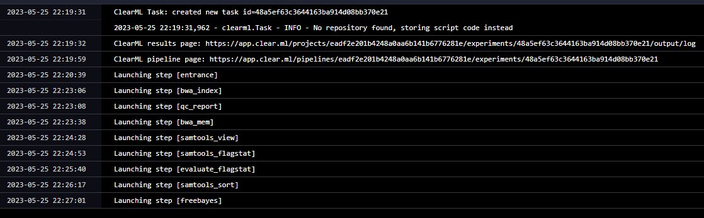
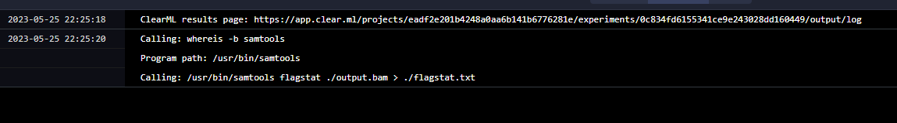
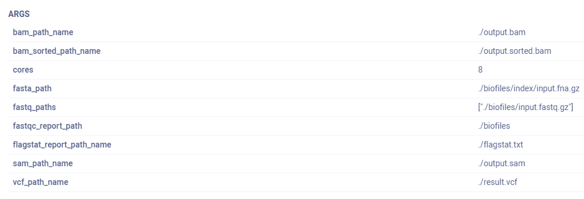
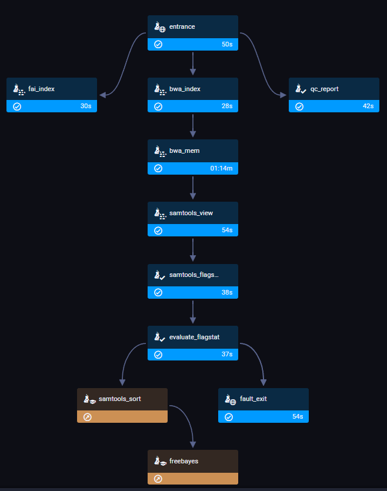

# Задание 3
## Задача - Собрать пайплайн для оценки качества картирования
## Использованные средства:
| Описание | Название | Ссылка | PM 
|---|---|---|---
| Фреймворк для пайплайна | ClearML | https://clear.ml/clearml-pipelines/ | pip
| Инструмент картирования / индексирования | BWA | https://github.com/lh3/bwa | apk
| Оценка качества результатов секвенирования | FastQC | https://www.bioinformatics.babraham.ac.uk/projects/fastqc/ | apk
| Конвертация SAM2BAM и оценка | Samtools | https://github.com/samtools/samtools | apk
| Коллинг генетических вариантов | FreeBayes | https://github.com/freebayes/freebayes | apk 
| Тестовые данные: Референсный геном | E. Coli | https://www.ncbi.nlm.nih.gov/assembly/GCF_000005845.2/
| Тестовые данные: Результат секвенирования (плохие) | Illumina NextSeq E. Coli WGS | https://www.ncbi.nlm.nih.gov/sra/SRX20419571[accn]

## Обзор некоторых требований к отчету и ответ на них
|Требование|Ответ
|---|---
|2 Скрипт на bash|`shell_pipeline.sh`
|3 Результат flagstat|`flagstat.txt`
|4 Скрипт разбора flagstat|`flagstat_qc.py`
|5 Файлы|слишком большие, в гит не влезли
|7 Пайплайновый helloworld|`hellopipeline.py`
|10 код пайплайна|`pipeline3.py`

Все остальное будет рассматриваться ниже

## Пайплайн

0. На агенте должны быть предустановленны все необходимые пакеты, указанные выше
0. `wget fastq.. & fasta`
    - (c этим проблемы, поэтому файлы надо вручную выкачивать)
0. `fastqc fastq..`
0. `bwa index fasta`
0. `samtools faidx fasta`
0. `bwa mem -t [CORES] fasta fastq.. > output.sam`
0. `samtools view -b output.sam > output.bam `
0. `samtools flagstat output.bam`
0. Парсинг результата flagstat и оценка качества mapped. Если качество меньше 90%, то дропаем пайплайн.
0. `samtools sort -o output.sorted.bam output.bam`s
0. `freebayes -f fasta output.sorted.bam > result.vcf`

## Краткий инструктаж по фреймворку
- Сам фреймворк является по факту оркестратором задач (экспериментов) по некоторым воркерам. Сервер оркестрации можно развернуть как самому, так и воспользоваться их сервисом. Воркеров всегда определяет пользователь, они не предоставляют вычислительные мощности. Каждая задача в пайплайне является задачей, которая оркестрируется на свободные, на текущий момент, машины, которые слушают очередь, в которую поставилась задача. Всю информацию об оркестрации и проводимых экспериментах и задачах можно просматривать на самом сервере оркестрации. В особо крайних случаях возможно локально запускать пайплайн, локально исполнять задачи и отправлять на сервер лишь результаты и статистику исполнения.
- Для уменьшения количества телодвижений было решено не развертывать свой сервер. Для настройки питона можно пройтись вот по этому гайду https://clear.ml/docs/latest/docs/getting_started/ds/ds_first_steps#local-python
    - Вкратце - нужно установить `clearml` запустить `clearml-init` и передать credentials, которые можно найти в личном кабинете.
- Для определения агента _(я в итоге отказался от этого в связи с долгой обработкой и косяками со скачиванием файлов)_ необходимо установить еще `clearml-agent` и запустить `clearml-agent init` после чего так же внести свои credentials (https://clear.ml/docs/latest/docs/clearml_agent)
- Всё дальнейшее оперирование происходит из кода (выбор платформы запуска, определение пайплайнов и т.д.)
- Так же в дашборде сервиса, в панели оркестрации, в очередях (queues) необходимо добавить 2 очереди (без них ничего не работало) - `defaults` и `services` - https://app.clear.ml/workers-and-queues/queues
- Если использовать агента, а не запускать локально, необходимо поднять его `clearml-agent daemon --queue defaults services`
- В текущей папки можно найти своеобразный helloworld для запуска пайплайна из двух элементов. На изображении пример отображения пайплайна в дашборде. 
- На каждом шаге можно посмотреть все параметры, которые были получены/переданы по цепочке.

## Разбор результатов работы пайплайна
- В качестве примера я использовал 2 разных fastq файла, одн из которых выдаёт 91%, другой 70% (ссылка на файл с 91% была утеряна)
- Рассмотрим пайплайн на "хороших" данных
    - Имеем следующую конфигурацию пайплайна 
        - 
    - В случае с хорошими данными получаем такой граф 
        - 
    - Общие логи запуска пайплайна пишут лишь очередность исполнения 
        - 
    - Частные логи отработки каждого из шагов имеются в консольном выводе шага (например отчет по исполнению flagstat) 
        - 
- На плохих данных у нас поменяется конфигурация, и исполняемые шаги
    - Соответственно в конфигурации изменяется fastq_paths 
        - 
    - И граф не будет заходить на 2 последних шага, а пропустит их 
        - 

## Отличия
Поскольку я старался сделать пайплайн, максимально приближенный к изначальному пайплайну, описанному в задании в блок-схеме, то и отличий почти нет, кроме того, что делаю еще `.fai` индекс.

## Проблемы
- Не получилось выкачивать в пайплайне данные напрямую по ссылке, поэтому запускать пайплайн возможно только локально, не через воркеров.
- Выставления очередности исполенния шагов в пайплайне крайне странная: вроде в документации сказано, что в декораторе можно выставить `parents` и тогда шаг не будет запускаться до момента, пока не выполнится шаг в `parents`, однако в реальности это не так, и шаги начинают запускаться все вместе. Единственный реальный способ связать в цепь шаги - возвращаемые входящие данные одного шага должны зависеть от выходящих данных предыдущего шага. Именно поэтому там везде в коде прокидывается переменная chain, которая по сути ничего не делает, кроме как связывания шагов.

