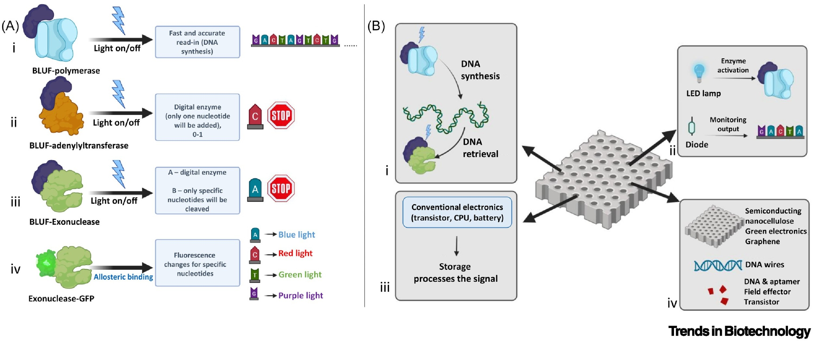
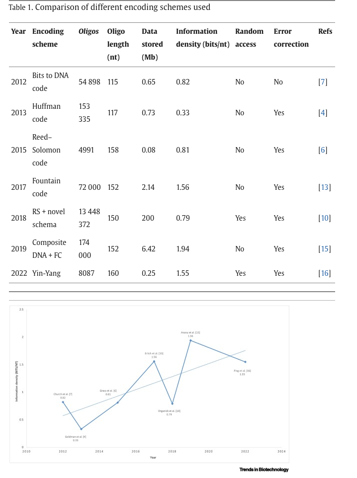

# Задание 0.2: Новости биоинформатики за 2023
Бортников Павел 20215

### 1. Новые исследования в области использования ДНК как способа хранения информации

https://www.sciencedirect.com/science/article/pii/S0167779923002159

Как утверждают авторы, уже существуют наработки в этой области, которые позволяют рекордным образом сжать объемы информации с длительным временем жизни, однако стоимость одного мегабайта составляет примерно 400 тысяч долларов и скорость чтения крайне низкая.

Их решение предполагает использование полупроводниковых наноцелюлозных композитов, которые контролируются белками управляемыми светом (light-gated) для чтения-записи из хранилища. 

Так же стоит задача кодирования информации из битовой в днк-последовательность. Сейчас учеными рассматривается несколько алгоритмов, которые авторы оценили и сравнили. Так же они отмечают некоторый тренд роста эффективности алгоритмов.

