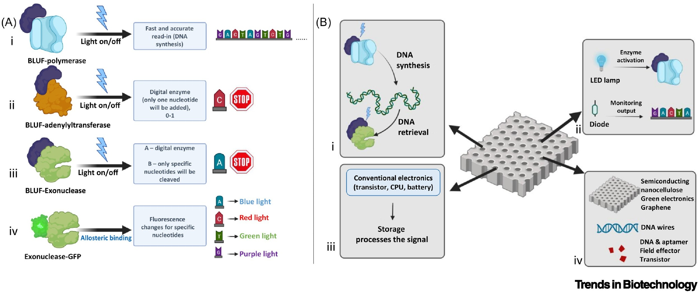
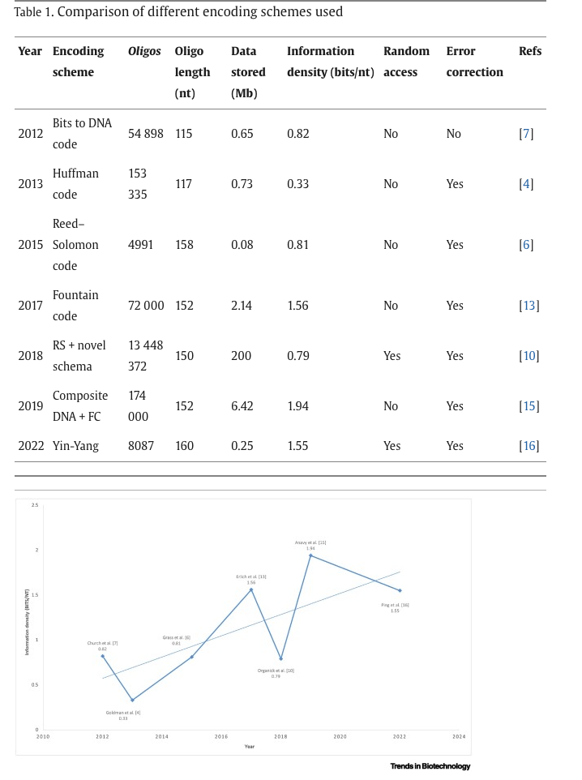
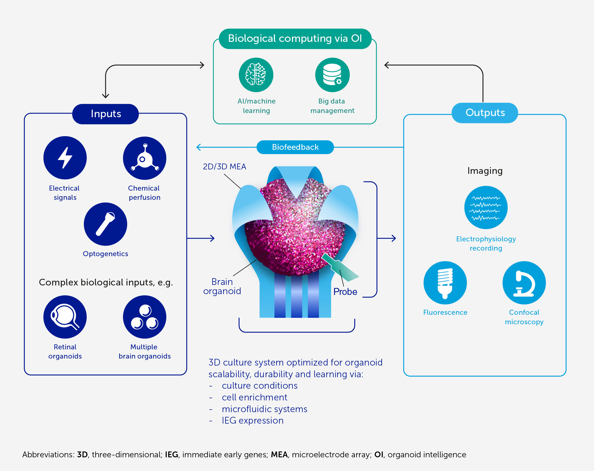
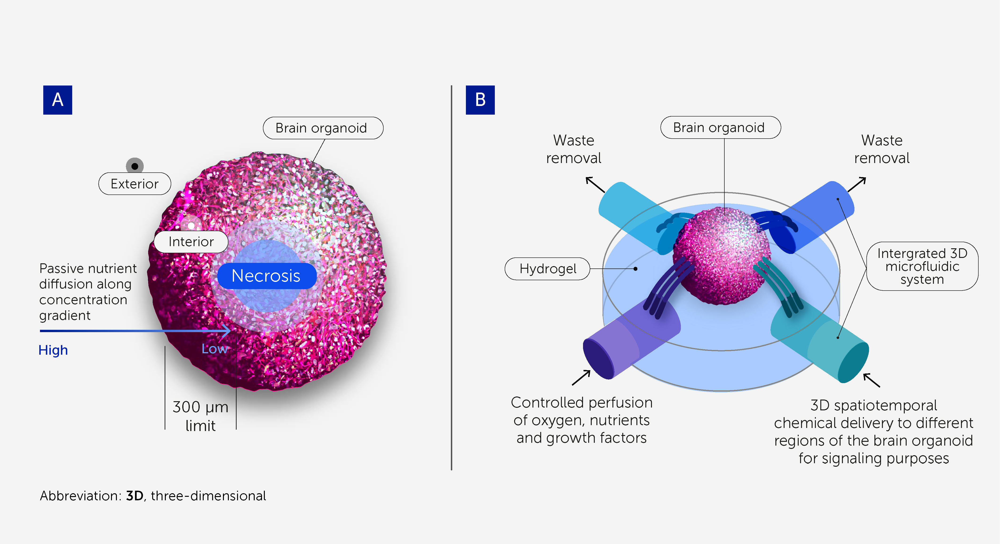
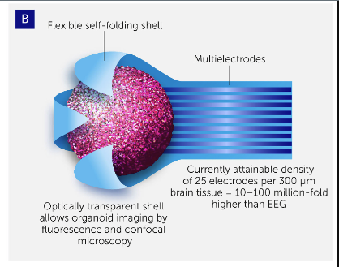

# Задание 0.2: Новости биоинформатики за 2023
Бортников Павел 20215

### 1. Новые исследования в области использования ДНК как способа хранения информации

https://www.sciencedirect.com/science/article/pii/S0167779923002159

Как утверждают авторы, уже существуют наработки в этой области, которые позволяют рекордным образом сжать объемы информации с длительным временем жизни, однако стоимость одного мегабайта составляет примерно 400 тысяч долларов и скорость чтения крайне низкая.

Их решение предполагает использование полупроводниковых наноцелюлозных композитов, которые контролируются белками управляемыми светом (light-gated) для чтения-записи из хранилища. 

Так же стоит задача кодирования информации из битовой в днк-последовательность. Сейчас учеными рассматривается несколько алгоритмов, которые авторы оценили и сравнили. Так же они отмечают некоторый тренд роста эффективности алгоритмов.

### 2. Развивающееся направление биокомпьютеров (органоидного интеллекта (ОИ))

https://www.frontiersin.org/journals/science/articles/10.3389/fsci.2023.1017235/full

(это не то чтобы новость с чем-то новым и прорывным, но скорее обзорная статья по текущей ситуации, проблемам и следующим шагам развития биокомпьтинга)

Биокомпьютеры могут быть в несколько раз мощнее обычных полупроводниковых чипов, при этом почти не потребляя энергии. Например (при грубом сравнении), мозг человека по своим вычислительным мощностям сопоставим с передовым суперкомпьютером 2020-го года. При этом суперкомпьютер потребляет 21 мегаватт, а мозг всего 20 ватт. 

В статье ввели понятие органоидного интеллекта, который шире описывает биокомпьютинг включая в себя трехмерные структуры мозговых клеток (мозговые органоиды). 

Мозговые органоиды, в свою очередь, отличаются от уже существующих двухмерных сетей своей, более приближенной, к реальным условиям мозга, трехмерной структурой. Собственно современная задача и заключается в том, чтобы "приручить" вычислительные мощности мозговых органоидов.

Авторы они описывают идею оперирования с органоидами - создание трехмерной проводниковой структуры биофидбека, внутри которой как раз находится органоид. Предполагается, что с органоидом можно взаимодействовать снаружи при помощи электрических / химических сигналов, синтетических машинных сигналов, или же при помощи натуральных сигналов с сенсорных органоидов (зрительных/слуховых)

Далее описывается проблема поддержки жизнеспособности органоида: из-за того, что он обладает трехмерной формой, снаружи до центра не доходят вещества и клетки в центре отмирают. Они предлагают способ решения в виде микрофлюидной системы передачи веществ по всему органоиду. Эти же системы могут обеспечить химическое сигналирование.

Ну и почти что основная часть - чтение сигналов. Предложенная трехмерная сетка / корпус предполагает, что электродами будет покрыта вся поверхность органоида, что дает не предельную, но достаточно высокую точность чтения электросигнала с поверхности. Они так же предлагают дальнейшее развитие в виде наращивания органоида вокруг некоторой трехмерной сетки для увеличения разрешения сигнала.

