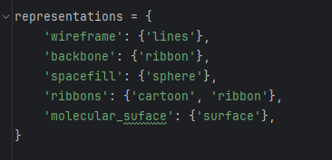
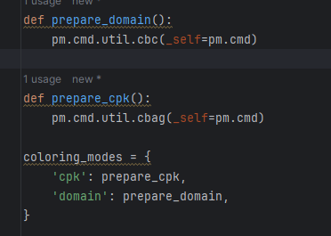
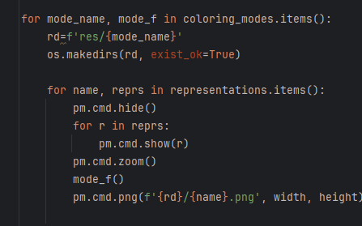
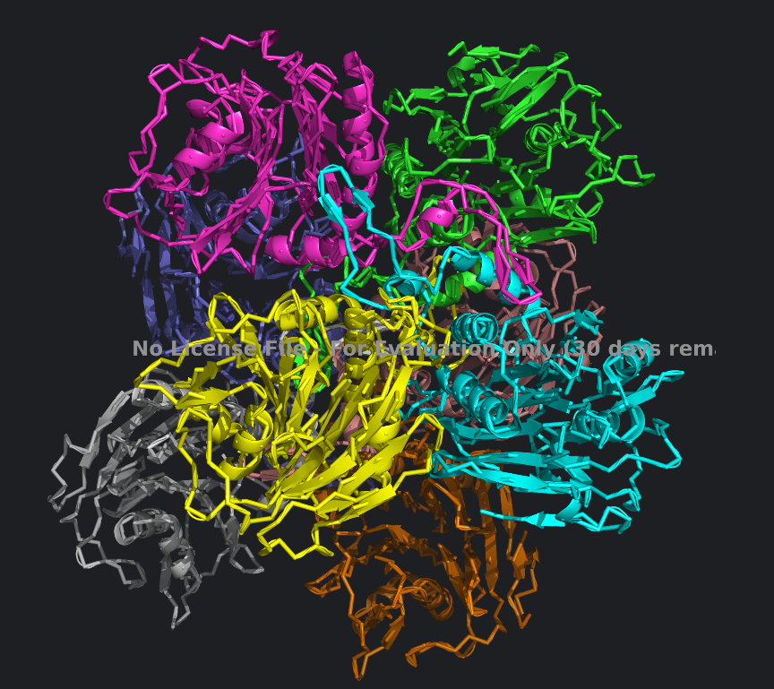

# Задание 4 Визуализация структуры белка

* ПО - pymol (https://pymol.org/2/)
* Белок - https://www.rcsb.org/structure/8ESI

Изображения находятся в папке res. Разделены на цветовую модель CPK и по доменам

## Описание способа визуализации
1. Нужно выгрузить питоновское окружение с их сайта или из конды
2. Описываем какие отображения мы хотим получить
3. Функции подготовки отображения 
4. Проход по режимам отображения и желаемым репрезентациям, сохранение в файлы

## Картинка для публикации

Если закрыть глаза на банер с активацией, то, мне кажется, вот эта
картинка хорошо подойдет для репрезентации :)
