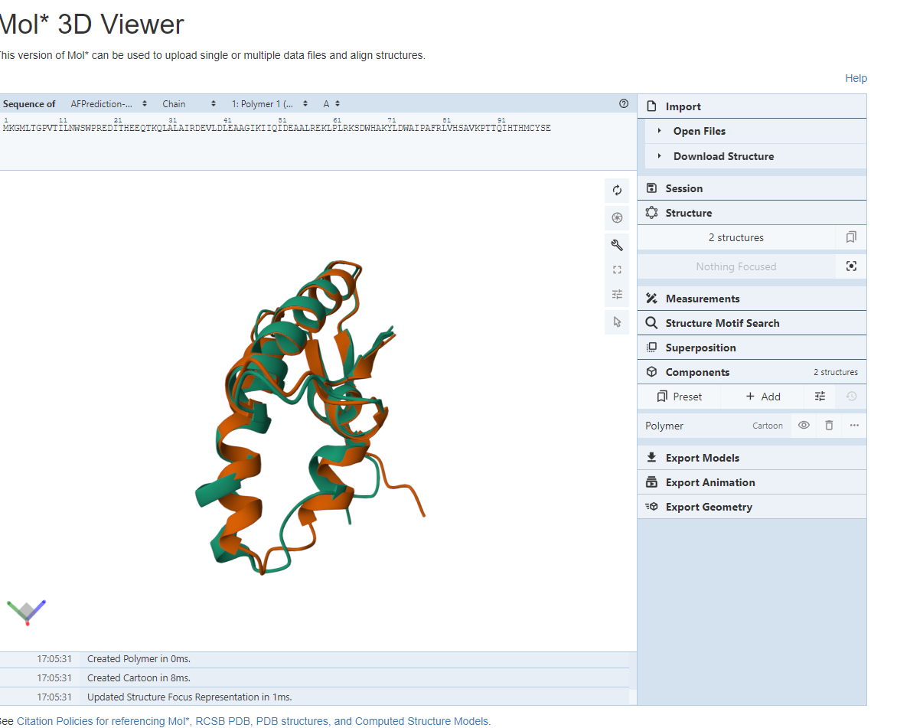

# Задание 5 Бортников Павел 20215

Предсказание и парное выравнивание структур белков

**Последовательность:** 

MKGMLTGPVTILNWSWPREDITHEEQTKQLALAIRDEVLDLEAAGIKIIQIDEAALREKLPLRKSDWHAKYLDWAIPAFRLVHSAVKPTTQIHTHMCYSE

Инструменты фолдинга белков:
ESMFold
OpenFold У МЕНЯ НЕ ЗАПУСТИЛСЯ, ПОЭТОМУ ИСПОЛЬЗОВАЛ AlphaFold2

Инструмент парного выравнивания: CLICK

**Инструмент визуализации:** https://www.rcsb.org/3d-view/

## Полученные ноутбуки с предсказанной структурой

**ESMFold:**

- [Google Colaboratory](https://colab.research.google.com/drive/14wYhoNn04jB35WxARTz8TCJK2_E6gjkm?usp=sharing)

**AlphaFold2:**

- [Google Colaboratory](https://colab.research.google.com/drive/1uv4exsvDaxO8cUwoLHvSsFjinTh-j1CB?usp=sharing)

**Изображения:**

## Сессия из программы визуализации 
**Раскрашивание:**

- Зеленый цвет - ESMFold
- Красный - AlphaFold2

## Краткие выводы о совпадении полученных предсказаний

На первый взгляд может показаться, что предсказания получились разные. Однако визуализация выравнивания показывает, что данные предсказания обладают несколькими схожими участками. Таким образом, можно сказать, что предсказания крайне схожи между собой.

Следует также ожидать, что в будущем мы будем получать более точные предсказания молекулярных структур, поскольку в настоящее время область искусственного интеллекта начала стремительно развиваться.
